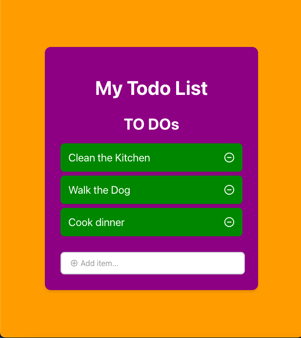

# ToDo App Documentation

## Description of Project

This project is a simple and interactive web application that helps users manage their tasks. Users can add new tasks, and remove them from the list. The app provides a clean and user-friendly interface to enhance the user experience.

## How to Run

- Clone this repository to your local machine.
- Navigate to the project directory.
- Run **npm install** to install the necessary dependencies.
- Run **npm start** to start the application.
- Open your web browser and go to http://localhost:3000 to see the app in action.

## Features 

- **Add New Task:** Users can add new tasks using the input field and hitting enter or clicking the add button.
- **Remove Task:** Users can remove a task by clicking on it.
- **Responsive Design:** The application is styled to be responsive and user-friendly on different devices.

## Roadmap of future improvements 

1. Adding user controls for marking tasks as done.
2. Implementing an edit feature for tasks.
3. Adding filters to view tasks based on their completion status.
4. Enhancing the UI with more animations and better styling.

## License Information

This project is licensed under the MIT license. For more information, please refer to the MIT [license](./LICENSE) documentation.

